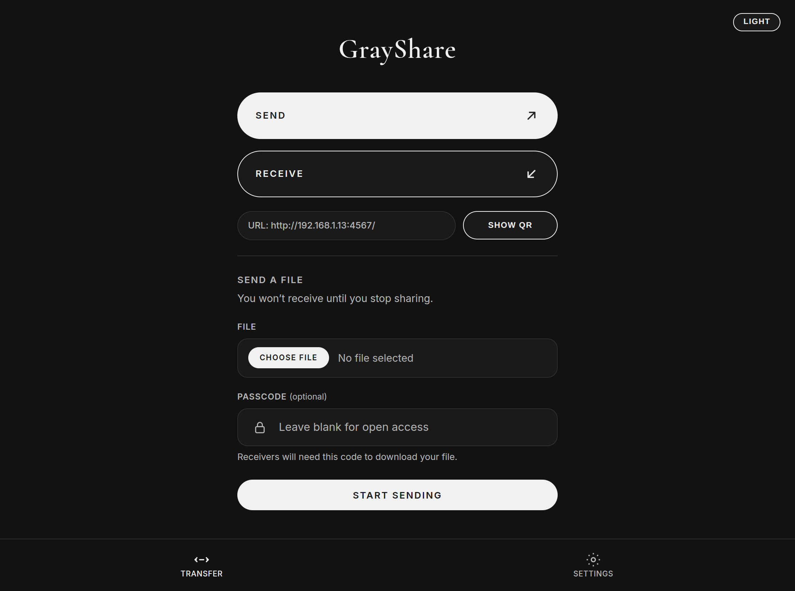

# GrayShare

GrayShare is a LAN file-sharing app: a desktop host (Windows, macOS, or Linux) with a zero-install browser client for other devices on the same network. A headless server mode is also available for machines without a display.

<p align="center">
    
</p>

Send and receive files on the LAN, including multi-file zip bundles, a QR code with a per-launch access key, optional passcodes, live share updates, Range-aware downloads, and transfer history on disk. How it fits together: [docs/architecture.md](docs/architecture.md). Binding choices: [docs/decisions/_index.md](docs/decisions/_index.md). Agent protocol: [AGENTS.md](AGENTS.md).

## Run from source

```bash
python3 -m venv .venv
source .venv/bin/activate        # Linux/macOS
# .\.venv\Scripts\Activate.ps1   # Windows PowerShell
pip install -r requirements.txt pyinstaller
```

Linux GUI mode also needs WebKitGTK, e.g. `sudo apt install python3-gi gir1.2-webkit2-4.1 libgtk-3-0`.

```bash
python desktop_app.py            # Linux/macOS
# .\.venv\Scripts\python.exe .\desktop_app.py   # Windows
```

API only: `python -m uvicorn main:app --reload`

Headless (prints LAN URL + access key):

```bash
python desktop_app.py --server-only --port 4567
```

The desktop window talks to loopback (`127.0.0.1`). Phones use the LAN URL shown in the app (QR includes `?k=`). Logs: `startup.log` and `backend.log` under the per-OS data dir (Windows `%USERPROFILE%\.grayshare`, macOS `~/Library/Application Support/GrayShare`, Linux `~/.local/share/grayshare`). Details: [docs/architecture.md](docs/architecture.md).

## Build

Windows portable exe + NSIS: `.\build_portable.ps1 -SkipInstall` (outputs `dist\GrayShare.exe`; full script also builds `GrayShare-Setup.exe`).

Linux/macOS: `./build.sh --skip-install` → `dist/grayshare`; add `--server-only` for `dist/grayshare-server`.

Packaging notes and a verify checklist: [docs/skills/package.md](docs/skills/package.md).

## Troubleshooting

If the desktop app fails to start, read `startup.log` and `backend.log` in the data dir above. If LAN clients cannot connect: same network, Windows Firewall allows GrayShare on private networks, and the network is not using client isolation.
